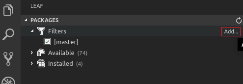
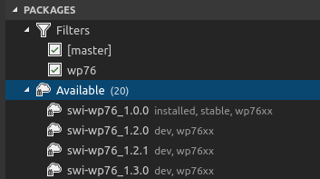
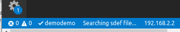
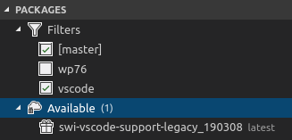
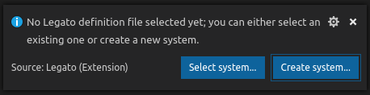
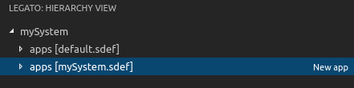
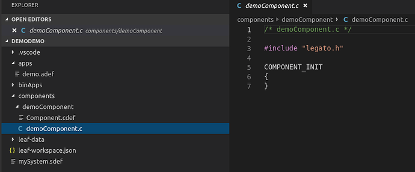
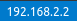
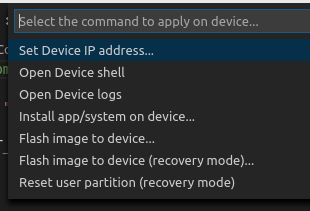
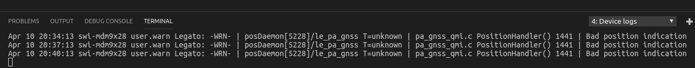

# Legato for VS Code

The Legato Plugin for VS Code puts tools into your hands to accelerate the development workflow
and provide a visual map of how all the system pieces are put together for building the Legato runtime environment.

The Legato team is proud to announce the next generation of an **Integrated Development Environment (IDE)** to develop Legato Systems, Apps and Components.

The plugin provides simple to use tools hooked up to a well known IDE that incorporates the Legato workflows and convenient tools
to let you develop and troubleshoot Legato.

The Legato Plugin for VS Code puts **tools into your hands to ease the learning curve and provide a visual map** of how all the system pieces are put together for building the Legato runtime environment.

## Legato Plugin Current Features:

 Full integration with **[Leaf Workspace Manager](https://docs.legato.io/latest/confLeaf.html)** - install and upgrade Legato and associated tools
  that your target requires.
- Legato System View - a logical view of your Legato system model with the ability to add and edit
  existing systems.
- Add new apps and components using templates that set up your system using Legato best practices.
- Build your system and install on your target in one step.
- Code completion for your C/C++ code with autocompletion for legato.h and the C/C++ standard
  library.
- Debugging with GDB support.
- Support for adding, editing and removing components through the Legato System view.
- Error correction and handling for both the definition files and APIs.

We welcome feedback and want to know what features are important for our users.

Please post feedback, ask questions, or report bugs [here](https://forum.legato.io/c/vscode)

## To set up the Legato Plugin:

**Note:** Current support for the Legato Plugin is only for Linux machines (either virtual or physical). The Legato build tools rely on a Linux environment to make the system and app images for your targets.

1. Download and install [VSCode](https://code.visualstudio.com/Download) (see [Install guide for VSCode](https://code.visualstudio.com/docs/?dv=linux64_deb))

2. Search for “Legato” in the VSCode Marketplace and install the extension

3. Open a folder as your Legato workspace. **[Ctrl + K + 0]** (Make or choose a folder to use as a workspace and click **Ok**)

4. Install **Leaf** (2.1 or higher) on your dev machine if not already installed:
> - `wget https://downloads.sierrawireless.com/tools/leaf/leaf_latest.deb -O /tmp/leaf_latest.deb`
> - `sudo apt install /tmp/leaf_latest.deb`

5. Click on the **Leaf Icon**  on the right hand toolbar to search and install a current SDK for your target (for example swi-wp76-3.0.3 for the wp76 target; for details on leaf see: https://docs.legato.io/latest/confLeaf.html)

    - Add a filter for your target and then type the partial name for the target (i.e., **wp76, wp77, wp85, wp75**)
      

    - Expand the **Available** list
      

    - Highlight the SDK you wish to install and click **Add to profile…** , name your profile and then follow any prompts in the terminal window.
      **You have now successfully installed the Legato SDK for your target.**
      The current profile will show up on the bottom toolbar of VSCode.
      

    - Next, add a filter for **IDE** (to install the legato tools for vscode support)
      

    - **Add to profile** the **swi-vscode-support** package to your **existing** leaf profile

6. Follow the prompts to create a new system.
   Either select your .sdef if you have one or create a new one from our template.
   

7. A new **Legato Icon**  will appear in the left-hand menu.
   This is the **Legato System View** and will show you the logical view and the relationships between systems, and apps (components are coming in the next release).
   

    - Expand the **default.sdef** apps to see the Platform Services included with Legato, or click on **New app** to create your own application and start coding within Legato.

    - Creating a **New App** will create the components, a .c file and the .adef for you from templates. To view these files and start working with them switch to the  **Explorer** view and start coding.
      

## Building and Installing your Code onto your Target

1. When you are ready click on the  IP Address at the bottom tool bar to configure your target:
   

2. Press **Ctrl + Shift + B** to quickly **Build** or **Build and Install** your system onto your target.

3. To view the logs, click on  and choose **Open Device logs**, this will open the logs in a terminal to troubleshoot any issues.
   

4. Running **Build** on your code will parse the code with the mktools and provide you logs in the terminal that you can then use to figure out errors and issues.
